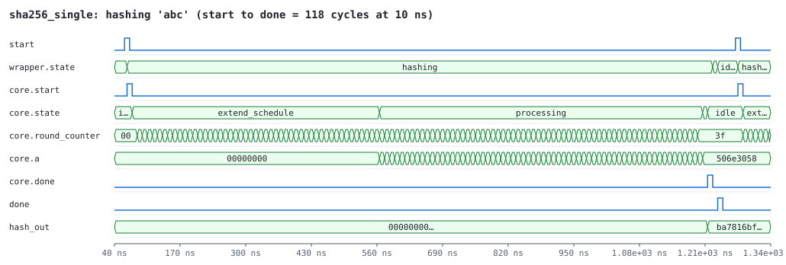
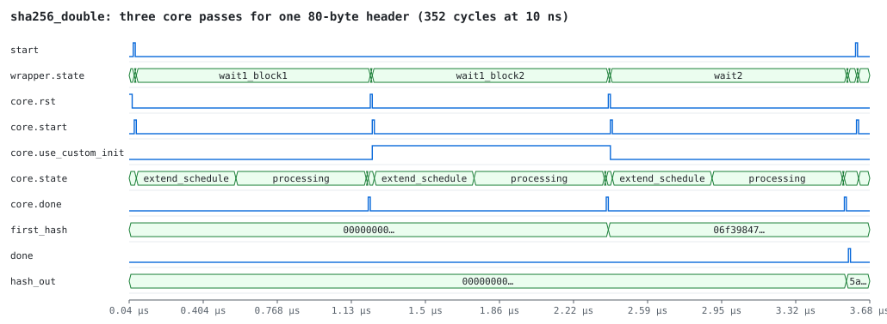
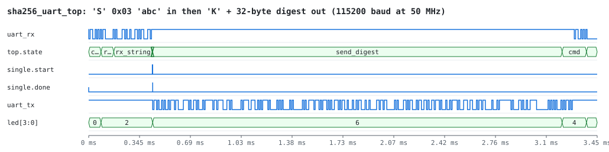

# SHA-256 in VHDL

A SHA-256 hardware core (FIPS 180-4) in VHDL. It can hash a short string or
compute Bitcoin's double SHA-256 of an 80-byte block header, and it talks to
a PC over a serial (UART) link so it can run on an FPGA board.

Everything is verified in simulation with open-source tools: GHDL for VHDL,
Yosys for a synthesis check, and Python's `hashlib` as the reference.

## How it is built

The design is four layers. Each one only uses the layer below it.

```
 PC (host/sha256_uart.py)
        │  serial cable, 115200 baud
┌───────▼──────────────────────────────────────────────────────────────┐
│ board/fpga_top        clock + reset for one specific board (template)│
│ ┌──────────────────────────────────────────────────────────────────┐ │
│ │ rtl/sha256_uart_top   receives bytes, starts a hash, sends 32 B  │ │
│ │ ┌──────────────────────────────────────────────────────────────┐ │ │
│ │ │ rtl/sha256_single   pads a 0..55-byte string, 1 core pass    │ │ │
│ │ │ rtl/sha256_double   Bitcoin header, 3 core passes            │ │ │
│ │ │ ┌──────────────────────────────────────────────────────────┐ │ │ │
│ │ │ │ rtl/sha256_core   hashes one 512-bit block               │ │ │ │
│ │ │ └──────────────────────────────────────────────────────────┘ │ │ │
│ │ └──────────────────────────────────────────────────────────────┘ │ │
│ └──────────────────────────────────────────────────────────────────┘ │
└──────────────────────────────────────────────────────────────────────┘
```

**`sha256_core`**
- Takes one padded 512-bit block and works one step per clock cycle:
  - load the 16 message words;
  - expand them to 64 words (48 cycles);
  - run the 64 compression rounds (64 cycles);
  - add the result to the hash state.
- Latency is 118 cycles per block. A chaining input lets one block continue
  from the previous one.
- **Handshake:**
  - raise `start` to begin;
  - `done` goes high when the hash is ready;
  - `done` stays high while `start` is held.

**`sha256_single`** adds the standard padding (`0x80`, zeros, message
length) to a string of up to 55 bytes, which fits in one block.

**`sha256_double`** computes `SHA256(SHA256(header))` with three passes:
- header bytes 0–63;
- bytes 64–79 plus padding, chained from the first pass;
- the padded 32-byte result of pass 2.

The header goes in exactly as it appears on the wire, and the output is the
raw digest. Block explorers display those 32 bytes reversed.

**`sha256_uart_top`** keeps the wide data buses inside the FPGA. Only clock,
reset, UART RX/TX and 4 LEDs reach the pins. Protocol:

| PC sends | FPGA answers |
|---|---|
| `'S'` `<len>` `<len bytes>` (len ≤ 55) | `'K'` + 32-byte SHA-256 |
| `'B'` `<80 header bytes>` | `'K'` + 32-byte double SHA-256 |
| anything else, or len > 55 | `'E'` |

A frame that stalls for 100 ms is dropped.

**LEDs:** heartbeat, busy, last command OK, last command error.

**`board/`** is a template. It shows the clock and reset for a Xilinx
7-series board and lists the pins to fill in. See
[board/README.md](board/README.md).

## Repository layout

```
rtl/       the design (core, wrappers, UART, top)
tb/        self-checking testbenches
board/     template for putting it on a specific FPGA board
host/      PC-side script for the UART protocol
scripts/   Python cross-check against hashlib, waveform figure generator
docs/img/  waveform figures generated from simulation
Makefile   shortcuts: make test, make wave, make synth, make docs
```

## Run the simulations

**Tools.**
- **Linux:** `sudo apt install ghdl yosys`
- **macOS:**
  - Yosys: `brew install yosys`
  - GHDL: download the release for your system from
    [github.com/ghdl/ghdl/releases](https://github.com/ghdl/ghdl/releases),
    unpack it to `~/.local/opt/ghdl` and add its `bin/` to `PATH`.
- **Waveform viewer (optional):** [Surfer](https://surfer-project.org/)
  (`brew install surfer`) or GTKWave.

```sh
make test                          # everything; ends with "== ALL CHECKS PASSED"
make sim  TB=tb_sha256_double      # one testbench with every check printed
make wave TB=tb_sha256_single      # then: surfer build/tb_sha256_single.ghw
make synth                         # synthesis check + rough resource estimate
```

**What is tested.**
- **`tb_sha256_single`** (31 checks):
  - strings of 0, 1, 3, 4, 5, 26, 54 and 55 bytes, checking padding and hash;
  - `start` held high, back-to-back hashes, `start` while busy, reset in the
    middle of a hash.
- **`tb_sha256_double`** (27 checks):
  - 7 headers, including two real Bitcoin blocks (Genesis and #125552),
    checked against their published block hashes;
  - handshake and reset cases.
- **`tb_sha256_uart_top`** (20 checks): real serial frames at 115200 baud.
  It covers valid commands, an unknown command, a too-long string, and a
  stalled frame followed by recovery.
- **Python:** every expected value in the testbenches is recomputed with
  `hashlib`. The host script also runs against a software model of the board.

### Waveforms







## Use it on a board

1. Adapt `board/` to your board: clock, reset, pins. See
   [board/README.md](board/README.md).
2. Build `fpga_top` with your vendor's tools and check the timing report.
3. Talk to it from the PC:

```sh
pip install pyserial
python3 host/sha256_uart.py --port <serial port> string "abc"
python3 host/sha256_uart.py --port <serial port> genesis
python3 host/sha256_uart.py --port <serial port> selftest   # known + random inputs vs hashlib
python3 host/sha256_uart.py --fake selftest                 # no board: software model
```

## Numbers

| | Value | Source |
|---|---|---|
| Latency, one block | 118 clock cycles | simulation |
| Latency, Bitcoin header | 352 clock cycles | simulation |
| At 50 MHz | ~2.4 µs per block, ~7 µs per header | computed |
| Size of `sha256_uart_top` | ~12k LUT, ~9k FF, 8 pins | Yosys estimate |

- The Yosys numbers are only an estimate; vendor tools usually report fewer
  LUTs.
- The board template uses 50 MHz because a Vivado post-synthesis run of the
  core on Artix-7 put its critical path at about 10.6 ns. That path is the
  `W[t]` word select followed by the round's adder chain.
- The design has not been through place and route or run on hardware yet.

## Limitations and ideas

- **Strings up to 55 bytes (one block).** The core supports chaining, so
  multi-block hashing is a wrapper extension.
- **The message schedule keeps all 64 words** (2048 flip-flops). A 16-word
  sliding window would save area and shorten the critical path.
- **One round per clock.** Unrolling or pipelining the rounds would raise
  throughput, at the cost of area.
- **Two cores in the UART top,** one per wrapper. Sharing one would roughly
  halve the area.

## About

Started as a university project (Advanced Logic Design, 2025) and extended
since into a self-contained, tested design.

Author: Andrei-Christian Popescu. License: MIT, see [LICENSE](LICENSE).
